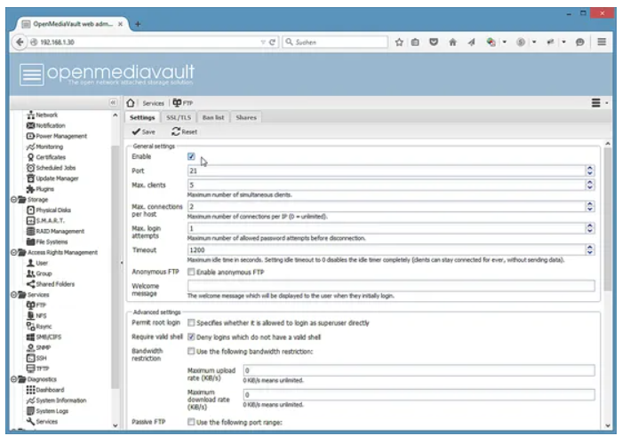

### How to build your own NAS with OpenMediaVault
-------------------------------------------------
#### Table of Contents
----------------------
+ How to build your own NAS with OpenMediaVault.
+ Table of Contents.
+ Project Description.
+ Requirements.
+ Download OpenMediaVault.
+ Setting Up The Server Environment.
  + Prepare the Boot Media.
  + Virtual Machine.
+ OpenMediaVault Installation.
+ Login details.
+ First steps in OpenMediaVault
  + Change the web admin password.
  + Enable FTP.
  + Create a file system as data storage volume.
  + Add a user.
+ Work Cited.

#### Project Description
------------------------
In this project, i'm creating an OpenMediaVault. OpenMediaVault is a Debian based special purpose Linux Distribution to build a Network Attached Storage (NAS) System. It provides an easy to use web-based interface, Multilingual support, Volume Management, Monitoring and a plugin system to extend it with LDAP, Bittorrent, and iSCSI capabilities. This tutorial describes the installation and configuration of OpenMediaVault.

#### Requirements
-----------------
+ PC with 32 or 64Bit Intel processor.
+ Min. 1GB RAM.
+ 2 Hard disks (or one hard disk with 2 partitions). OpenMediaVault requires a separate disk or partition for the OS install and a separate disk or partition for the data.

#### 1) Download OpenMediaVault

The first step is to download the OpenMediaVault ISO file from Sourceforge. 
(https://sourceforge.net/projects/openmediavault/files/)

The software exists in flavors for 32- and 64Bit Intel/AMD processors and for some other platforms like Raspberry PI, Odroid and Cubox i. I will choose the version for 64Bit processors (amd64). The direct download link for the current 2.1 version is:
(http://downloads.sourceforge.net/project/openmediavault/2.1/openmediavault_2.1_amd64.iso?r=&ts=1438327317&use_mirror=netcologne)

#### 2) Prepare the Boot Media
The ISO image can be used to install OpenMediaVault into a virtual machine like VMWare or Virtualbox directly. To install the software on real hardware, you need a boot media like a CD / DVD or a bootable USB stick.

##### Create a bootable USB Stick on Linux:

The following command can be used to write the ISO file on the USB Stick on Linux;

    sudo dd if=openmediavault_2.1_amd64.iso of=/dev/sdX bs=4096

Replace /dev/sdX with the device name of the USB drive. Please be careful, the dd command can cause severe damage if you select a wrong drive as target.

#### 3) Virtual Machine
+ 2048 MB as memory.
+ 2 Processors.
+ 128 MB as Video memory.
  

#### 4) OpenMediaVault Installation

Insert the boot Media that you prepared for the installation into the PC or Server were OpenMediaVault shall be installed and start or reboot the system. It might be necessary to select the correct boot media device in the BIOS.

When the System booted successfully you will see the following screen of the OpenMediaVault installer. Select the "Install" option and press enter or wait until the installation starts automatically.

Select the language for the installation process.
.png)
Select your location. The location will be used to define the timezone in one of the next steps and to preselect the keyboard layout.
.png)
select the keyboard Layout.
.png)
The installer starts to load some additional packages from installation media. Give it some time.
Enter the hostname of your server. The domain name is requested in the next screen, so the hostname here is the first part of the fully qualified domain name. When the server shall have the fqdn "server1.example.com" then the hostname is "server1".
.png)
Enter the domain name of the server.
.png)
Enter the root password. This password is used for the shell login, it is not the password of the OpenMediaVault Web interface. Confirm the password by entering it again in the next screen when requested.
.png)
Select the server time zone and press (Enter)
.png)
The installer starts to copy the system files to Disk now.
.png)
Configure the location from where the apt package manager will load the software packages.
.png)
Select the mirror server.
.png)
When you use a http proxy to access the internet, then enter it's details here. Otherwise press (Enter).
.png)
The installation is finished. Press (Enter) to reboot the server.
.png)
The Grub boot screen appears. it will starts automatically.
.png)
The System ready. You can now login to OpenMediaVault on the shell as root user or in the Web interface.
.png)

#### 5) Login details

Web interface

+ User: admin

+ Password: openmediavault

Client (SSH, console)

+ User: root
+ Password: The password that you have set during installation

Open a web browser and enter http:// followed by your IP address.

Enter the default login details user: admin, password: openmediavault:
.png)

#### 6) First steps in OpenMediaVault

This chapter shows the steps to secure the login, enable an FTP and SMB/CIFS share and how to enable access by SSH.

#### 7) Change the web admin password

To change the web administrator password, go to "General Settings" and change to the tab "Web Administrator Password; enter the new password and press on the "Save" button in the upper left corner of the input form.
.png)

#### 8) Enable FTP
Go to Services > FTP and enable the "Enable" Checkbox. Press the "Save" button in the upper left corner.

Click on "Apply" in the yellow bar that appears above the the form.

Then, confirm that the changes shall really be applied.

#### 9) Create a file system as data storage volume

OpenMediaVault needs a separate hard disk or partition to store data (storage volume). In my case, I'll use a second hard disk /dev/sdb. Click on Storage > File Systems > Create to add the second hard disk as a storage volume. The name of tmy storage volume is "data".

The final list of storage devices shall look like this. Select the "data" volume in the list and click on the "Mount" button to mount the volume. Only mounted volumes will appear as option in the shared folders volume list. 

#### 10) Add a user

Now we can add a user to access your file shares. Click on "Access Rights Management" > "User" > Add; Then enter the user details: username, email address, and password. Then confirm the changes.

----------------------------------------------------------------------------
#### Work Cited

Brehm, Till. “Build Your Own NAS with Openmediavault.” HowtoForge, Howtoforge, https://www.howtoforge.com/tutorial/install-open-media-vault-nas/. 